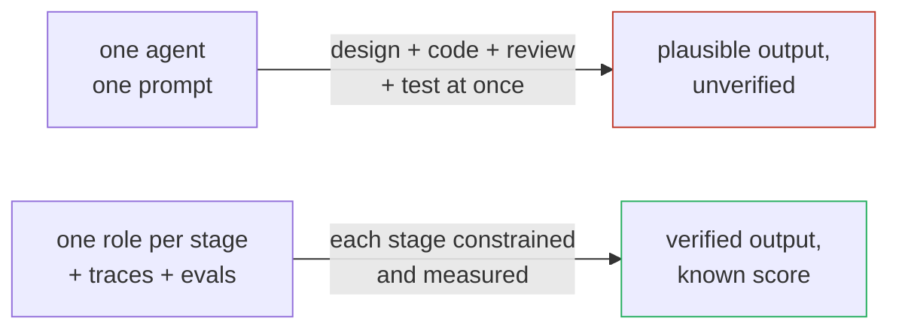
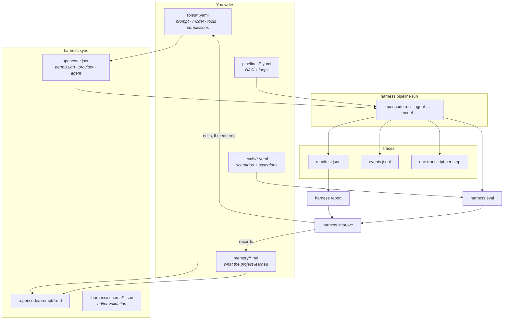
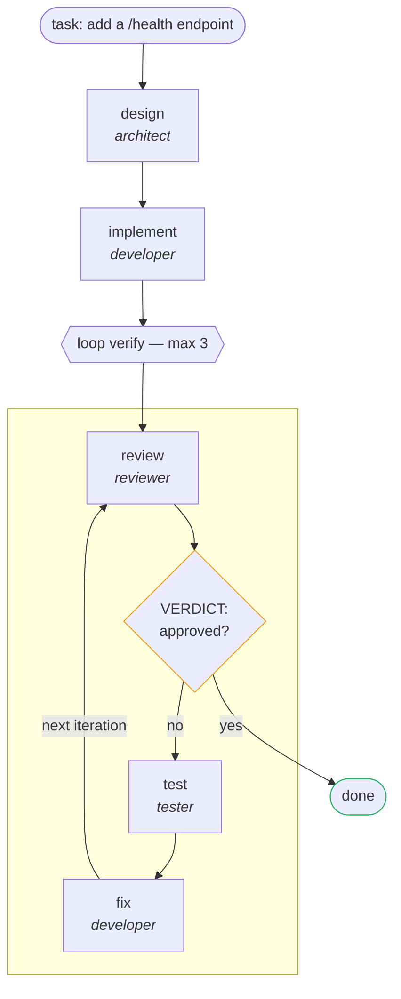
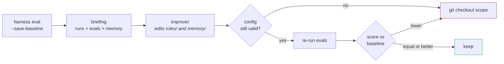

# harness

A project template for building software with **opencode**, driven by declarative
**roles** (YAML) and **pipelines** that chain them — with memory, sandboxing, tracing,
evaluation, and a self-improvement loop that is actually measured.

```bash
bun install
bun run harness init          # scaffold, then pick a provider and models
bun run harness sync          # generate opencode.json + system prompts
bun run harness doctor        # opencode, endpoints, sandbox, sync state
bun run harness pipeline run feature --input task="add a /health endpoint"
```

---

## Why

A coding agent handles one task well. Shipping a feature is not one task: it is designing,
implementing, reviewing, testing and fixing — and those stages want *opposite* things.
The designer must not write code. The reviewer must not fix what it reviews. The tester
must not weaken an assertion to get green. Put all of that in one prompt and you get an
agent that quietly optimises for looking done.

So: one role per stage, each with its own prompt, model, tools and permissions.

Three problems appear immediately, and this template exists to answer them.

**Where do the knobs live?** In most setups, "which model, which tools, which permissions,
which prompt" ends up scattered across shell scripts and copy-pasted config. Here every
role is one YAML file, diffable and reviewable, compiled into an `opencode.json` that
opencode reads natively.

**What happened during that run?** A pipeline of five agents that half-worked is
unreadable from a terminal scrollback. Every run writes a manifest and an append-only
event log: which step failed, which retried, which deliverable was never written, how many
times the review loop went around.

**Is the prompt I just changed actually better?** Without a measurement, prompt tuning is
superstition — everyone has "improved" a prompt into a regression. So evals replay
scenarios in an isolated git worktree and score them, and the `improve` command may only
touch prompts *between* two measurements, rolling back on regression.



---

## How it fits together



Nothing here is a wrapper around opencode's own behaviour: the generated `opencode.json`
is plain opencode configuration. Delete the harness and `opencode --agent lead` still
works.

---

## A run, concretely

The `feature` pipeline that ships with the template:



The exit condition is tested **as soon as the checked step has spoken** — if the review
approves, `test` and `fix` do not run for nothing. Steps whose dependencies are satisfied
run concurrently; a loop body runs in order.

---

## The self-improvement loop

This is the part worth being suspicious of, so it is the part with the most guardrails.



- **No measurement, no improvement.** Without a baseline the command refuses to start.
- **Scope.** `improve.scope` limits edits to `roles/` and `memory/`. Application code and
  pipelines are out of reach.
- **Reversibility.** Invalid config or a lower score ⇒ `git checkout` of the scope.
- **Traceability.** The improver's prompt requires every change to cite the trace that
  motivates it. "This would read better" is not a trace.

Honest limitation: the scope is a prompt instruction plus an after-the-fact check, not a
sandbox. The real protection is the git diff and the automatic rollback — which is why
`--apply` wants a clean working tree.

---

## What you get out of the box

| Concern | Where it lives | Command |
|---|---|---|
| Prompts | `roles/*.yaml` → `.opencode/prompt/` | `harness roles show <r> --prompt` |
| Tools & actions | `tools:` / `permission:` per role, `mcp:`, opencode skills | `harness roles show <r>` |
| Memory | `memory/*.md` + an index injected into prompts | `harness memory` |
| Workflow & loops | `pipelines/*.yaml`, `loop:` block | `harness pipeline run` |
| State | `.harness/state.json`, read as `{{ state.x }}` | `harness state set` |
| Subagents & teams | `team:` on a role, opencode's `task` tool | `harness roles show lead` |
| Permissions & sandbox | `permission:`, `.devcontainer/`, `firewall.sh` | `harness doctor` |
| Observability | `manifest.json`, `events.jsonl` | `harness report [--all]` |
| Evaluation | `evals/*.yaml`, isolated git worktree | `harness eval` |
| Self-improvement | `improver` role, `improve.scope` | `harness improve` |

Seven roles ship with the template: `lead` (delegates), `architect`, `developer`,
`reviewer`, `tester`, `judge` (scores evals), `improver` (fixes prompts).

---

## Models, including local ones

One global default, exceptions where they earn their keep:

```yaml
defaults:
  model: default
models:
  default: local/Qwen3-Coder-Next-MLX-8bit
  deep: local/Qwen3.5-122B-A10B-Text-mxfp4-mlx # used by one role, if you want
```

opencode does not know local servers natively, so `init` asks your endpoint what it serves
and writes the provider block for you:

```bash
harness init --provider openai-compatible --base-url http://127.0.0.1:8000/v1
```

Works with Ollama, LM Studio, oMLX, vLLM, LiteLLM — anything OpenAI-compatible.
`harness doctor` then compares declared models against served models, which is what
catches "server not running" and "model unloaded" before a run burns ten minutes.

---

## Documentation

| Document | Contents |
|---|---|
| [docs/concepts.md](docs/concepts.md) | Roles, models, pipelines, loops, memory, state, teams |
| [docs/configuration.md](docs/configuration.md) | Every key of `harness.config.yaml` |
| [docs/cli.md](docs/cli.md) | Full command reference |
| [docs/evaluation.md](docs/evaluation.md) | Evals, scoring, baselines, the improve loop |
| [docs/sandbox.md](docs/sandbox.md) | Dev container, permissions, network allowlist, browser |

---

## Requirements

- [Bun](https://bun.sh) ≥ 1.1
- [opencode](https://opencode.ai), authenticated or pointed at a local model server

Verified against opencode 1.17.15: `opencode agent list` loads the seven generated agents
with their modes, and a full pipeline run completes against a local open-weight model.

## Project layout

```
src/
  cli.ts                 argument parsing and dispatch
  config/schema.ts       zod schemas (role, pipeline, eval, config)
  config/jsonschema.ts   the same schemas, exported as JSON Schema for editors
  config/load.ts         loading, DAG validation, model aliases
  opencode/generate.ts   roles -> opencode.json + prompts, drift detection
  opencode/exec.ts       running `opencode run`
  core/orchestrator.ts   DAG, loops, retries, transcripts, manifest, events
  core/evaluate.ts       isolated worktree, assertions, scores, baseline
  core/memory.ts         entries, index, prompt injection
  core/state.ts          shared state
  core/events.ts         JSONL event log
  init/presets.ts        providers and model discovery
  init/apply.ts          rewriting scaffolded YAML, comments preserved
  commands/              one file per CLI command
template/                what `harness init` copies
```
