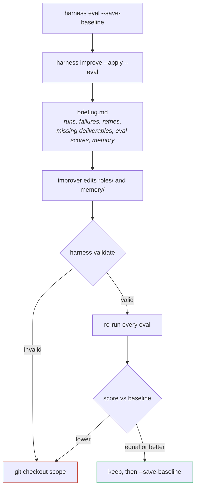

# Evaluation and self-improvement

Prompt tuning without measurement is superstition. Everyone has "improved" a prompt into a
regression and only found out three runs later. This is the part of the harness that makes
the difference visible — and it is a prerequisite for letting an agent edit its own
prompts.

## Observability first

Every run writes to `.harness/runs/<run-id>/`:

```
manifest.json     per step: status, model, duration, exit code, attempts,
                  missing deliverables, loop iterations
events.jsonl      append-only; a run that crashes still leaves a readable trace
<step>.md         one transcript per step (loops: <loop>.<iteration>.<step>.md)
```

```bash
harness report            # timeline of the last run
harness report --all      # per role: failures, retries, forgotten deliverables, duration
```

`report --all` is where improvement starts. A role that regularly forgets a deliverable is
a prompt problem. A role that regularly times out is a model or a scope problem. The table
tells you which conversation to have.

## Evals

An eval replays one scenario end to end and scores assertions against the result.

```yaml
# yaml-language-server: $schema=../.harness/schema/eval.json
description: Can the pipeline deliver a trivial endpoint — designed, tested and approved?
pipeline: feature

inputs:
  task: Add an HTTP GET /health endpoint returning {"status":"ok"}, and its test.

assert:
  - type: file_exists
    path: docs/design/latest.md

  - type: step_output
    step: review
    pattern: "VERDICT:\\s*approved"

  - type: command
    run: bun test
    expectExit: 0
    weight: 2

  - type: judge
    role: judge
    weight: 2
    prompt: Verify a GET /health endpoint really exists and returns 200 with {"status":"ok"}.
```

### Assertion types

| Type | Checks | Fields |
|---|---|---|
| `file_exists` | a file was produced | `path` |
| `file_contains` | a file matches a regex | `path`, `pattern` |
| `command` | a command's exit code | `run`, `expectExit` |
| `step_output` | a step's transcript matches a regex | `step`, `pattern` |
| `judge` | an agent inspects the real result | `role`, `prompt` |

All take an optional `weight` (default 1) and `description`. The score is the weighted
ratio of satisfied assertions.

A `judge` role must end its answer with `VERDICT: pass` or `VERDICT: fail`; anything else
counts as a failure, on purpose — an unparseable verdict is not a pass. The shipped judge
has `edit`, `write` and `patch` disabled: a judge that can write can repair what it is
supposed to judge.

Mix cheap checks with at least one judge. File and command assertions are fast and
objective but only see artefacts; the judge is the one that notices the endpoint returns
the right body.

### Isolation

Evals run agents that write files. Running them in your working tree would rewrite the
thing being judged, so `harness eval` creates a detached **git worktree** at HEAD, runs
there, scores there, and removes it afterwards (`--keep` to inspect it).

Without a git repository, the command refuses to start. `--in-place` overrides that and
says so loudly.

Note the consequence: an eval starts from **HEAD**, not from your uncommitted work. You are
measuring the committed state of the harness.

### Baselines

```bash
harness eval --save-baseline    # lock in the current level
harness eval                    # later runs are compared against it
```

`.harness/baseline.json` holds one score per eval and is meant to be committed. It is the
reference `improve` compares against.

## The improve loop



```bash
harness improve                 # propose only; writes a proposal, changes nothing
harness improve --apply         # apply, then validate and show the diff
harness improve --apply --eval  # …and re-evaluate, rolling back on regression
```

### What the improver is given

A briefing file at `.harness/improve/<timestamp>/briefing.md` — written to disk on purpose,
so you can read exactly what it was told:

- the current roles, with their model and mode;
- the last N runs: failed steps, retries, missing deliverables, loop counts, and the path
  of every transcript;
- the latest eval results, assertion by assertion, against the baseline;
- the memory index.

Its prompt carries one rule: **a change must be justified by a trace**. A failed run, a
deliverable never written, a loop that burned its budget, an assertion that flipped. With
no trace, changing nothing is the expected answer.

It is also told to separate prompt problems from the rest. A model that is too weak, a
missing tool or a `deny` permission are not fixed by adding "be careful" to a prompt, and
saying so is more useful than papering over it.

### The guardrails

1. **No measurement, no improvement.** Without a baseline the command refuses to start
   (`improve.requireBaseline`).
2. **Scope.** `improve.scope` limits edits to `roles/` and `memory/`. Application code,
   pipelines and configuration are out of reach.
3. **Validation.** A changed prompt still has to produce a valid workspace, or the scope is
   restored immediately.
4. **Regression rollback.** Any eval scoring below its baseline triggers
   `git checkout -- <scope>`.

### The limitation, stated plainly

The scope is a prompt instruction plus an after-the-fact check — not a sandbox. An agent
with `edit: allow` can write outside `roles/`, and nothing stops it at the tool level.
What protects you is the git diff and the automatic rollback, which is why `--apply` warns
on a dirty working tree and why the dev container exists.

If you want a hard boundary, run `improve` inside the container with a firewall, and keep
the working tree clean so the diff is unambiguous.

## A realistic cycle

```bash
harness eval --save-baseline                  # once, to know where you stand
harness pipeline run feature --input task=…   # real work, several times
harness report --all                          # which role is actually failing
harness improve --apply --eval                # measured, reversible fix
harness eval --save-baseline                  # if it improved, lock it in
```

Do not run `improve` after a single run: one trace is an anecdote. It is worth running once
you have a handful of runs and at least one eval that is not already at 100% — an eval that
always passes cannot tell you that something got better.
