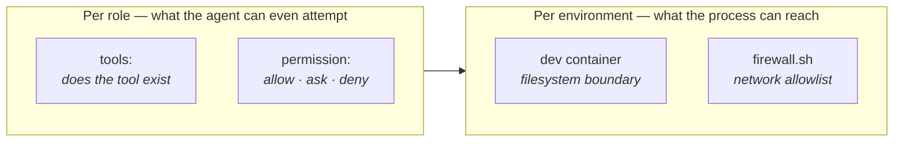

# Sandbox, permissions and the browser

Roles that build software need to run commands. `bash: allow` on a developer role is not
optional — and it is also the moment you should stop running agents directly on your
machine.

## Two layers of control



The first layer is declarative and precise but enforced by opencode; the second is coarse
and enforced by the OS. You want both: the reviewer that cannot call `edit` is a design
decision, the container that cannot reach the internet is a guarantee.

### Per role

```yaml
tools:
  edit: false # the tool is not offered to the model at all
  patch: false
  write: true

permission:
  edit: allow # the tool exists and may be used
  bash: allow # `ask` cannot be answered in a headless run
  webfetch: deny
```

`permission.bash` accepts command globs when you want a middle ground:

```yaml
permission:
  bash:
    "git push*": deny
    "rm -rf*": deny
    "*": allow
```

`harness validate` warns on any `ask` — in a pipeline there is nobody to answer, and the
step will hang or be denied depending on the version.

## The dev container

`.devcontainer/` gives you a machine you do not mind agents writing to.

```jsonc
{
  "image": "mcr.microsoft.com/devcontainers/typescript-node:1-22-bookworm",
  "runArgs": ["--cap-add=NET_ADMIN", "--cap-add=NET_RAW",
              "--add-host=host.docker.internal:host-gateway"],
  "containerEnv": { "HARNESS_SANDBOX": "1" },
  "mounts": [ /* named volumes for opencode credentials and the Playwright cache */ ],
  "postCreateCommand": "bash .devcontainer/setup.sh"
}
```

Three details that matter:

- **Named volumes** keep `opencode auth login` and the browser cache across rebuilds. You
  authenticate once, not every time you rebuild.
- **`host.docker.internal`** makes a model server running on your host reachable from
  inside. With Ollama on the host, point the provider at
  `http://host.docker.internal:11434/v1`.
- **`HARNESS_SANDBOX=1`** is what `harness doctor` reads to tell you whether you are
  inside the container.

`setup.sh` installs bun, `opencode-ai`, Chromium via Playwright, and the agent-browser
skill. It is idempotent — re-run it whenever you want.

## Network allowlist

The container still has full internet access by default. `firewall.sh` closes that:

```bash
sudo bash .devcontainer/firewall.sh
```

It resolves an allowlist of domains into an ipset, accepts DNS, loopback, established
connections and the host network, then sets the default `OUTPUT` policy to `DROP`. Edit
`ALLOWED_DOMAINS` to add your model provider.

Rules do not survive a container rebuild; re-run it after one. This needs `NET_ADMIN` and
`NET_RAW`, which is why the devcontainer requests them.

## Browser: agent-browser

The template wires in [vercel-labs/agent-browser](https://github.com/vercel-labs/agent-browser)
as an opencode skill, so a role can drive a real browser.

> **This part is not verified.** The repository's packaging was not accessible when the
> template was written, so `setup.sh` discovers rather than assumes: it clones the repo,
> copies any directory containing a `SKILL.md` into `.opencode/skill/`, and installs the
> package globally if it finds a `bin`. If you know the npm package name, skip all of that:
>
> ```bash
> AGENT_BROWSER_PKG=<package> bash .devcontainer/setup.sh
> ```

Chromium is installed through Playwright into a cached volume:

```bash
npx playwright install --with-deps chromium
```

`harness doctor` reports whether a skill directory and a Chromium binary are present. A
role that uses the browser needs `bash: allow`, and — if the firewall is on — the target
domains added to the allowlist.

## MCP servers

MCP is configured the opencode way and passed straight through:

```yaml
mcp:
  playwright:
    type: local
    command: ["npx", "-y", "@playwright/mcp@latest"]
```

The harness does not wrap MCP; whatever opencode supports, you get. Tools exposed by an
MCP server are subject to the same per-role `tools:` allowlist.

## Recommended posture

| Context | Setup |
|---|---|
| Exploring, reading code | Host, `edit: ask`, no bash |
| Real work on a project | Dev container, `edit: allow`, `bash: allow`, clean git tree |
| Evals | Isolated git worktree (automatic), inside the container |
| `improve --apply` | Container + clean tree, so the diff and the rollback are unambiguous |

The single most useful habit is a clean working tree before letting agents run. Not because
something will go wrong, but because when it does, `git diff` and `git checkout` are the
only tools that reliably tell you what happened and undo it.
